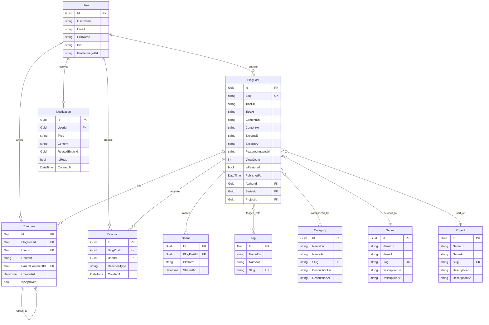

# Design Document: VersePress Blog Platform

## Overview

VersePress is a production-grade bilingual blog platform built on ASP.NET Core 9 MVC following Clean Architecture principles. The system provides comprehensive content management capabilities with real-time interactive features, supporting both English and Arabic languages with automatic RTL layout switching.

### Core Capabilities

- Bilingual content management (English/Arabic) with RTL support
- Real-time interactions via SignalR (reactions, comments, notifications)
- Theme persistence (Dark/Light mode)
- SEO optimization (meta tags, OpenGraph, JSON-LD, sitemap, RSS)
- Performance optimization targeting Lighthouse score ≥ 95
- Role-based access control (Author, Admin)
- Comprehensive analytics dashboard
- Responsive design for mobile, tablet, and desktop

### Technology Stack

- **Framework**: ASP.NET Core 9 MVC
- **Database**: SQL Server with Entity Framework Core
- **Real-time**: SignalR
- **Authentication**: ASP.NET Core Identity
- **Validation**: FluentValidation
- **Logging**: Serilog
- **Testing**: xUnit with 80% coverage target
- **Frontend**: Bootstrap 5, Lottie, Lordicon
- **Deployment**: Azure App Service with GitHub Actions CI/CD

## Architecture

### Clean Architecture Layers

The system follows Clean Architecture with four distinct layers:

#### 1. Domain Layer (Core)
- Contains enterprise business rules and entities
- No dependencies on other layers
- Defines core domain models: BlogPost, Comment, Reaction, Share, Tag, Category, Series, Project, Notification
- Defines domain interfaces and value objects
- Framework-agnostic and testable in isolation

#### 2. Application Layer
- Contains application business rules and use cases
- Depends only on Domain layer
- Defines service interfaces and DTOs
- Implements CQRS pattern with commands and queries
- Handles validation using FluentValidation
- Orchestrates domain logic and coordinates workflows

#### 3. Infrastructure Layer
- Implements interfaces defined in Application layer
- Handles data persistence via Entity Framework Core
- Implements Repository pattern with Fluent API configurations
- Manages external services (email, file storage)
- Configures SignalR hubs
- Implements logging with Serilog

#### 4. Web Layer (Presentation)
- ASP.NET Core 9 MVC application
- Handles HTTP requests and responses
- Implements controllers, views, and view models
- Manages authentication and authorization
- Configures middleware pipeline
- Serves static assets and manages client-side interactions


### Dependency Flow

```
Web Layer → Application Layer → Domain Layer
     ↓              ↓
Infrastructure Layer
```

- Web layer depends on Application and Infrastructure
- Application layer depends only on Domain
- Infrastructure layer depends on Application and Domain
- Domain layer has no dependencies

### Key Architectural Patterns

#### Repository Pattern
- Abstracts data access logic
- Provides generic CRUD operations via IRepository<T>
- Implements specialized repositories (IBlogPostRepository, ICommentRepository, etc.) for entity-specific queries
- All database operations are asynchronous
- Repositories accessed through Unit of Work

#### Unit of Work Pattern
- Coordinates multiple repository operations as a single transaction
- Provides IUnitOfWork interface exposing all repository instances
- Ensures all changes are committed or rolled back together
- Manages DbContext lifecycle and transaction boundaries
- Implements SaveChangesAsync for atomic persistence
- Automatically rolls back on operation failure
- Reduces duplicate code by centralizing transaction management

#### Dependency Injection
- All dependencies injected via constructor
- Services receive IUnitOfWork instead of individual repositories
- Configured in Program.cs
- Enables testability and loose coupling

#### CQRS (Command Query Responsibility Segregation)
- Separates read and write operations
- Commands modify state (Create, Update, Delete)
- Queries retrieve data without side effects
- Improves scalability and maintainability

## Components and Interfaces

### Domain Layer Components

#### Base Entity

**BaseEntity (Abstract)**
- Base class for all domain entities
- Properties:
  - Id (Guid): Primary key using GUID for distributed system support
  - CreatedAt (DateTime): Timestamp when entity was created
  - UpdatedAt (DateTime?): Timestamp when entity was last modified
  - IsDeleted (bool): Soft delete flag
- Implements soft delete pattern
- Automatically tracked by EF Core for audit purposes

#### Entities

All entities inherit from BaseEntity and include the base properties (Id, CreatedAt, UpdatedAt, IsDeleted).

**BlogPost**
- Core content entity with bilingual fields
- Additional Properties: Slug, TitleEn, TitleAr, ContentEn, ContentAr, ExcerptEn, ExcerptAr, FeaturedImageUrl, ViewCount, IsFeatured, PublishedAt, AuthorId
- Navigation properties: Author, Comments, Reactions, Shares, Tags, Categories, Series, Project
- Inherits: BaseEntity

**Comment**
- User-generated content with nested reply support
- Additional Properties: BlogPostId, UserId, Content, ParentCommentId, IsApproved
- Navigation properties: BlogPost, User, ParentComment, Replies
- Inherits: BaseEntity

**Reaction**
- Emoji-based engagement tracking
- Additional Properties: BlogPostId, UserId, ReactionType
- ReactionType enum: Like, Love, Celebrate, Insightful, Curious
- Inherits: BaseEntity

**Share**
- Social media share tracking
- Additional Properties: BlogPostId, Platform, SharedAt
- Platform enum: Twitter, Facebook, LinkedIn, WhatsApp
- Inherits: BaseEntity

**Tag**
- Content categorization with bilingual names
- Additional Properties: NameEn, NameAr, Slug
- Navigation properties: BlogPosts (many-to-many)
- Inherits: BaseEntity

**Category**
- Content organization with bilingual names
- Additional Properties: NameEn, NameAr, Slug, DescriptionEn, DescriptionAr
- Navigation properties: BlogPosts (many-to-many)
- Inherits: BaseEntity

**Series**
- Multi-part content organization
- Additional Properties: NameEn, NameAr, DescriptionEn, DescriptionAr, Slug
- Navigation properties: BlogPosts
- Inherits: BaseEntity

**Project**
- Project-based content grouping
- Additional Properties: NameEn, NameAr, DescriptionEn, DescriptionAr, Slug
- Navigation properties: BlogPosts
- Inherits: BaseEntity

**Notification**
- Real-time user notifications
- Additional Properties: UserId, Type, Content, RelatedEntityId, IsRead
- NotificationType enum: NewComment, CommentReply, NewReaction
- Inherits: BaseEntity


#### Domain Interfaces

```csharp
public interface IRepository<T> where T : class
{
    Task<T?> GetByIdAsync(Guid id);
    Task<IEnumerable<T>> GetAllAsync();
    Task<T> AddAsync(T entity);
    Task UpdateAsync(T entity);
    Task DeleteAsync(T entity);
    Task<bool> ExistsAsync(Guid id);
}

public interface IUnitOfWork : IDisposable
{
    // Repository properties
    IBlogPostRepository BlogPosts { get; }
    ICommentRepository Comments { get; }
    IReactionRepository Reactions { get; }
    INotificationRepository Notifications { get; }
    IRepository<Tag> Tags { get; }
    IRepository<Category> Categories { get; }
    IRepository<Series> Series { get; }
    IRepository<Project> Projects { get; }
    IRepository<Share> Shares { get; }
    
    // Transaction management
    Task<int> SaveChangesAsync(CancellationToken cancellationToken = default);
    Task BeginTransactionAsync();
    Task CommitTransactionAsync();
    Task RollbackTransactionAsync();
}

public interface IBlogPostRepository : IRepository<BlogPost>
{
    Task<BlogPost?> GetBySlugAsync(string slug);
    Task<IEnumerable<BlogPost>> GetPublishedPostsAsync(int page, int pageSize);
    Task<IEnumerable<BlogPost>> GetFeaturedPostsAsync(int count);
    Task<IEnumerable<BlogPost>> GetPostsByAuthorAsync(Guid authorId);
    Task<IEnumerable<BlogPost>> SearchPostsAsync(string query);
    Task<bool> SlugExistsAsync(string slug);
}

public interface ICommentRepository : IRepository<Comment>
{
    Task<IEnumerable<Comment>> GetCommentsByPostAsync(Guid blogPostId);
    Task<IEnumerable<Comment>> GetPendingCommentsAsync();
    Task<int> GetPendingCommentCountAsync();
}

public interface IReactionRepository : IRepository<Reaction>
{
    Task<Reaction?> GetUserReactionAsync(Guid blogPostId, Guid userId);
    Task<Dictionary<ReactionType, int>> GetReactionCountsAsync(Guid blogPostId);
}

public interface INotificationRepository : IRepository<Notification>
{
    Task<IEnumerable<Notification>> GetUserNotificationsAsync(Guid userId, bool unreadOnly);
    Task<int> GetUnreadCountAsync(Guid userId);
    Task MarkAsReadAsync(Guid notificationId);
}
```

### Application Layer Components

#### Services

**BlogPostService**
- Handles blog post creation, editing, publishing
- Generates unique slugs
- Manages featured post selection
- Receives IUnitOfWork via dependency injection
- Uses UnitOfWork.BlogPosts repository for data access
- Calls UnitOfWork.SaveChangesAsync() to persist changes

**CommentService**
- Manages comment creation and moderation
- Handles nested comment structure
- Triggers real-time notifications
- Coordinates approval workflow
- Receives IUnitOfWork via dependency injection
- Uses UnitOfWork.Comments and UnitOfWork.Notifications repositories

**ReactionService**
- Processes reaction additions and removals
- Manages user reaction state (one per user per post)
- Broadcasts real-time updates
- Aggregates reaction counts
- Receives IUnitOfWork via dependency injection
- Uses UnitOfWork.Reactions repository

**SearchService**
- Implements full-text search across bilingual content
- Ranks results by relevance
- Handles query parsing and sanitization
- Receives IUnitOfWork via dependency injection
- Uses UnitOfWork.BlogPosts repository for queries

**NotificationService**
- Creates notifications for user actions
- Manages notification delivery via SignalR
- Tracks read/unread status
- Receives IUnitOfWork via dependency injection
- Uses UnitOfWork.Notifications repository

**AnalyticsService**
- Aggregates platform statistics
- Generates dashboard metrics
- Tracks view counts and engagement
- Receives IUnitOfWork via dependency injection
- Uses multiple repositories through UnitOfWork

**SeoService**
- Generates meta tags and OpenGraph data
- Creates JSON-LD structured data
- Builds XML sitemap and RSS feed
- Manages canonical URLs and hreflang tags
- Receives IUnitOfWork via dependency injection
- Uses UnitOfWork.BlogPosts repository


#### DTOs (Data Transfer Objects)

**BlogPostDto**
- Transfers blog post data between layers
- Includes computed fields (reaction counts, comment counts)
- Supports localization context

**CommentDto**
- Represents comment with user information
- Includes nested replies structure
- Contains approval status

**CreateBlogPostCommand**
- Command for creating new blog posts
- Includes validation rules
- Contains bilingual content fields

**UpdateBlogPostCommand**
- Command for updating existing blog posts
- Validates ownership and permissions

**ApproveCommentCommand**
- Command for comment moderation
- Triggers notification to comment author

#### Validators

**BlogPostValidator**
- TitleEn/TitleAr: 5-200 characters
- ContentEn/ContentAr: minimum 100 characters
- Slug: matches pattern ^[a-z0-9-]+$
- FeaturedImageUrl: valid URL format

**CommentValidator**
- Content: 1-2000 characters
- BlogPostId: must reference existing post
- ParentCommentId: must reference existing comment if provided

**ContactFormValidator**
- Name: required, 2-100 characters
- Email: required, valid email format
- Subject: required, 5-200 characters
- Message: required, 10-5000 characters

### Infrastructure Layer Components

#### Folder Structure

```
src/VersePress.Infrastructure/
├── Data/
│   ├── ApplicationDbContext.cs
│   ├── Configurations/
│   │   ├── BlogPostConfiguration.cs
│   │   ├── CommentConfiguration.cs
│   │   ├── ReactionConfiguration.cs
│   │   ├── ShareConfiguration.cs
│   │   ├── TagConfiguration.cs
│   │   ├── CategoryConfiguration.cs
│   │   ├── SeriesConfiguration.cs
│   │   ├── ProjectConfiguration.cs
│   │   └── NotificationConfiguration.cs
│   └── Seeds/
│       ├── DatabaseSeeder.cs
│       ├── UserSeeder.cs
│       ├── TagSeeder.cs
│       ├── CategorySeeder.cs
│       ├── SeriesSeeder.cs
│       ├── ProjectSeeder.cs
│       └── BlogPostSeeder.cs
├── Repositories/
│   ├── UnitOfWork.cs
│   ├── Repository.cs
│   ├── BlogPostRepository.cs
│   ├── CommentRepository.cs
│   ├── ReactionRepository.cs
│   └── NotificationRepository.cs
└── Hubs/
    ├── NotificationHub.cs
    └── InteractionHub.cs
```

#### DbContext Configuration

**ApplicationDbContext**
- Inherits from IdentityDbContext for user management
- Configures all entities using Fluent API
- Defines relationships and constraints
- Implements soft delete pattern via global query filter
- Automatically sets CreatedAt and UpdatedAt timestamps via SaveChangesAsync override

**Fluent API Configurations**

```csharp
// BaseEntity Configuration (applied to all entities)
protected override void OnModelCreating(ModelBuilder builder)
{
    base.OnModelCreating(builder);
    
    // Configure global query filter for soft delete
    foreach (var entityType in builder.Model.GetEntityTypes())
    {
        if (typeof(BaseEntity).IsAssignableFrom(entityType.ClrType))
        {
            builder.Entity(entityType.ClrType)
                .HasQueryFilter(GetSoftDeleteFilter(entityType.ClrType));
        }
    }
}

// Soft delete filter: e => !e.IsDeleted
private static LambdaExpression GetSoftDeleteFilter(Type entityType)
{
    var parameter = Expression.Parameter(entityType, "e");
    var property = Expression.Property(parameter, nameof(BaseEntity.IsDeleted));
    var condition = Expression.Not(property);
    return Expression.Lambda(condition, parameter);
}

// Override SaveChangesAsync to handle timestamps and soft delete
public override async Task<int> SaveChangesAsync(CancellationToken cancellationToken = default)
{
    var entries = ChangeTracker.Entries<BaseEntity>();
    
    foreach (var entry in entries)
    {
        switch (entry.State)
        {
            case EntityState.Added:
                entry.Entity.CreatedAt = DateTime.UtcNow;
                entry.Entity.UpdatedAt = DateTime.UtcNow;
                break;
            case EntityState.Modified:
                entry.Entity.UpdatedAt = DateTime.UtcNow;
                break;
            case EntityState.Deleted:
                entry.State = EntityState.Modified;
                entry.Entity.IsDeleted = true;
                entry.Entity.UpdatedAt = DateTime.UtcNow;
                break;
        }
    }
    
    return await base.SaveChangesAsync(cancellationToken);
}

// BlogPost Configuration
builder.Entity<BlogPost>(entity =>
{
    entity.HasKey(e => e.Id);
    entity.HasIndex(e => e.Slug).IsUnique();
    entity.HasIndex(e => e.PublishedAt);
    entity.HasIndex(e => e.AuthorId);
    entity.HasIndex(e => e.IsDeleted); // Index for soft delete queries
    
    entity.Property(e => e.Id).ValueGeneratedOnAdd();
    entity.Property(e => e.TitleEn).IsRequired().HasMaxLength(200);
    entity.Property(e => e.TitleAr).IsRequired().HasMaxLength(200);
    entity.Property(e => e.ContentEn).IsRequired();
    entity.Property(e => e.ContentAr).IsRequired();
    entity.Property(e => e.Slug).IsRequired().HasMaxLength(250);
    
    entity.HasOne(e => e.Author)
          .WithMany(u => u.BlogPosts)
          .HasForeignKey(e => e.AuthorId)
          .OnDelete(DeleteBehavior.Restrict);
    
    entity.HasMany(e => e.Comments)
          .WithOne(c => c.BlogPost)
          .HasForeignKey(c => c.BlogPostId)
          .OnDelete(DeleteBehavior.Cascade);
});

// Comment Configuration
builder.Entity<Comment>(entity =>
{
    entity.HasKey(e => e.Id);
    entity.HasIndex(e => e.BlogPostId);
    entity.HasIndex(e => e.CreatedAt);
    entity.HasIndex(e => e.IsDeleted); // Index for soft delete queries
    
    entity.Property(e => e.Id).ValueGeneratedOnAdd();
    entity.Property(e => e.Content).IsRequired().HasMaxLength(2000);
    
    entity.HasOne(e => e.ParentComment)
          .WithMany(c => c.Replies)
          .HasForeignKey(e => e.ParentCommentId)
          .OnDelete(DeleteBehavior.Restrict);
});

// Many-to-Many: BlogPost <-> Tag
builder.Entity<BlogPost>()
    .HasMany(p => p.Tags)
    .WithMany(t => t.BlogPosts)
    .UsingEntity<PostTag>(
        j => j.HasOne(pt => pt.Tag).WithMany().HasForeignKey(pt => pt.TagId),
        j => j.HasOne(pt => pt.BlogPost).WithMany().HasForeignKey(pt => pt.BlogPostId)
    );
```


#### SignalR Hubs

**NotificationHub**
- Manages real-time notification delivery
- Methods: SendNotification, MarkAsRead
- Groups users by UserId for targeted messaging

**InteractionHub**
- Broadcasts reactions and comments in real-time
- Methods: BroadcastReaction, BroadcastComment
- Groups clients by BlogPostId for efficient updates

#### Repository Implementations

**UnitOfWork**
- Implements IUnitOfWork interface
- Manages ApplicationDbContext lifecycle
- Exposes all repository instances as properties
- Implements SaveChangesAsync for atomic persistence
- Implements transaction management methods
- Disposes DbContext properly
- Ensures all changes are committed or rolled back together

**Repository<T>**
- Generic base class implementing IRepository<T>
- Receives ApplicationDbContext via constructor
- Implements common CRUD operations
- All operations are asynchronous
- Used by specialized repositories

**BlogPostRepository**
- Implements IBlogPostRepository
- Inherits from Repository<BlogPost>
- Uses EF Core with async operations
- Includes related entities (Author, Tags, Categories)
- Implements caching for frequently accessed posts
- Provides entity-specific query methods

**CommentRepository**
- Implements ICommentRepository
- Inherits from Repository<Comment>
- Loads nested comment structure efficiently
- Filters by approval status based on user role
- Provides comment-specific query methods

**ReactionRepository**
- Implements IReactionRepository
- Inherits from Repository<Reaction>
- Provides reaction aggregation methods
- Checks for existing user reactions

**NotificationRepository**
- Implements INotificationRepository
- Inherits from Repository<Notification>
- Provides user-specific notification queries
- Implements mark as read functionality

### Web Layer Components

#### Controllers

**HomeController**
- Index: displays featured and recent posts
- About: static page
- Contact: contact form submission
- Error: custom error pages (404, 500)

**BlogController**
- Details: displays single blog post with comments and reactions
- ByTag: lists posts by tag
- ByCategory: lists posts by category
- BySeries: lists posts in series
- ByProject: lists posts in project
- Search: search results page

**AuthorController**
- Profile: displays author information and posts
- Dashboard: author's personal dashboard

**AdminController**
- Dashboard: analytics and moderation overview
- Posts: manage all blog posts
- Comments: moderate pending comments
- Users: user management
- Analytics: detailed analytics reports

**AccountController**
- Login: user authentication
- Register: new user registration
- Logout: session termination
- Profile: user profile management

#### View Models

**HomeViewModel**
- FeaturedPosts: List<BlogPostDto>
- RecentPosts: List<BlogPostDto>
- CurrentPage: int
- TotalPages: int

**BlogPostDetailViewModel**
- Post: BlogPostDto
- Comments: List<CommentDto>
- ReactionCounts: Dictionary<ReactionType, int>
- UserReaction: ReactionType?
- RelatedPosts: List<BlogPostDto>
- PreviousInSeries: BlogPostDto?
- NextInSeries: BlogPostDto?

**AdminDashboardViewModel**
- TotalPosts: int
- TotalComments: int
- TotalUsers: int
- TotalReactions: int
- PendingComments: List<CommentDto>
- TopPostsByViews: List<BlogPostDto>
- TopPostsByReactions: List<BlogPostDto>
- RecentShares: List<ShareDto>

#### Middleware

**LocalizationMiddleware**
- Detects language from cookie or Accept-Language header
- Sets current culture (en-US or ar-SA)
- Applies RTL layout for Arabic

**ThemeMiddleware**
- Reads theme preference from cookie
- Injects theme class into layout

**ExceptionHandlingMiddleware**
- Catches unhandled exceptions
- Logs with Serilog
- Returns custom error pages

**PerformanceMonitoringMiddleware**
- Tracks request duration
- Logs slow requests (>1000ms)
- Adds performance headers


## Data Models

### Entity Relationship Diagram



### Database Schema Details

#### Indexes

**Performance-Critical Indexes:**
- BlogPost.Slug (unique, for URL lookups)
- BlogPost.PublishedAt (for chronological queries)
- BlogPost.AuthorId (for author filtering)
- Comment.BlogPostId (for comment retrieval)
- Comment.CreatedAt (for sorting)
- Reaction.BlogPostId (for aggregation)
- Notification.UserId (for user notifications)
- Tag.Slug (unique, for URL lookups)
- Category.Slug (unique, for URL lookups)

**Composite Indexes:**
- (Reaction.BlogPostId, Reaction.UserId) - for checking existing reactions
- (Comment.BlogPostId, Comment.IsApproved) - for approved comment queries

#### Constraints

- BlogPost.Slug: unique, non-null, max 250 characters
- User email: unique, non-null
- Comment.Content: max 2000 characters
- BlogPost titles: max 200 characters
- Reaction.UserId + BlogPost.Id: unique together (one reaction per user per post)

#### Cascade Behaviors

- BlogPost deletion → CASCADE to Comments, Reactions, Shares
- User deletion → RESTRICT (prevent if has blog posts)
- Comment deletion → CASCADE to child comments
- Tag/Category deletion → CASCADE junction table entries

